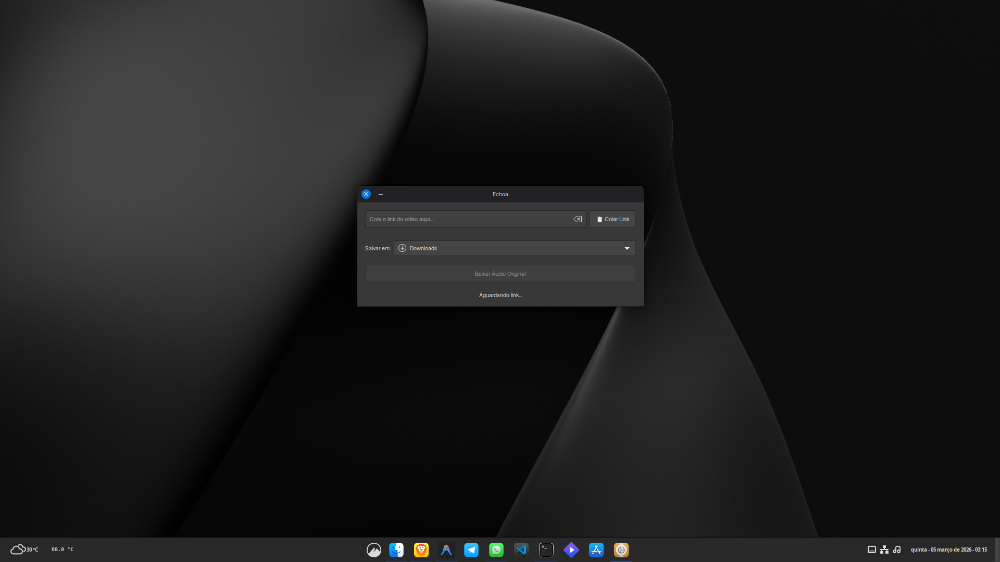

# 🎵 Echoa

<p align="center">
      
    </p>
    
**Echoa** é um baixador de áudio simples e moderno para Linux, construído com Python e GTK3. Ele permite extrair áudio de vídeos do YouTube com facilidade, oferecendo escolha de qualidade e suporte nativo a Flatpak.

## ✨ Funcionalidades
* **Interface Intuitiva**: Design limpo que segue as diretrizes do GNOME.
* **Preview de Vídeo**: Veja a miniatura e o título antes de baixar.
* **Seleção de Qualidade**: Escolha entre diferentes taxas de bits (kbps) disponíveis.
* **Integração com Sistema**: Botão de colar inteligente e seletor de pastas nativo.
* **Segurança**: Roda de forma isolada via Sandbox do Flatpak.

## 🚀 Como Executar (Desenvolvimento)

### Pré-requisitos
Certifique-se de ter o `flatpak` e o `flatpak-builder` instalados no seu sistema.

### Construção e Execução
1. Clone o repositório:
   ```bash
   git clone [https://github.com/yorrany/eChoa.git](https://github.com/yorrany/eChoa.git)
   cd eChoa
